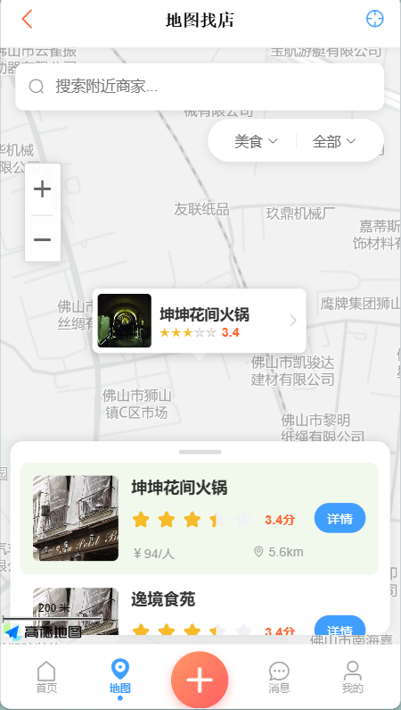

# Smart Live App

[](https://vuejs.org/)
[](https://vitejs.dev/)
[](https://vant-ui.github.io/vant/)
[](https://element-plus.org/)
[](./LICENSE)
[](./CONTRIBUTING.md)

一个面向本地生活场景的 Vue 3 前端项目，覆盖「找店 -> 搜索 -> 代金券 -> 下单 -> 评价 -> 社交 -> 消息 -> AI 助手」完整链路。  
项目以移动端 H5 为主，适合做全栈联调、课程实践和开源作品集展示。

## 在线预览

- 暂无公开演示地址（建议部署后补充）
- 本地启动：`npm run dev`

## 页面预览

将截图放到 `docs/screenshots/` 后即可在 GitHub 首页展示。

| 首页 | 地图找店 | AI 助手 |
| --- | --- | --- |
|  |  |  |

| 搜索页 | 消息页 | 个人中心 |
| --- | --- | --- |
|  |  |  |

## 核心功能

- 首页信息流：热门流、关注流、分类流统一展示。
- 地图找店：定位、地图筛选、附近商家联动列表。
- 全局搜索：店铺、代金券、博客、用户多类型搜索。
- 店铺和代金券：普通券与秒杀券的展示、购买与详情链路。
- 订单系统：状态筛选、支付倒计时、取消/退款、去评价。
- 评价体系：多维评分、图文/视频上传、草稿保存与发布。
- 社交互动：关注、点赞、收藏、评论与回复定位跳转。
- 即时通信：私聊会话、未读统计、系统消息中心。
- AI 助手：SSE 流式输出、会话管理、会话搜索、卡片推荐。
- 用户中心：资料、动态、收藏、关注粉丝、钱包积分等模块。

## 技术栈

| 类别 | 技术 |
| --- | --- |
| 框架 | Vue 3 |
| 构建工具 | Vite 4 |
| 路由 | Vue Router 4 |
| UI | Vant 4 + Element Plus |
| 请求层 | Axios（统一拦截器） |
| 实时通信 | WebSocket |
| 流式响应 | Fetch + SSE |
| Markdown 渲染 | markdown-it |
| 状态管理 | Vue `reactive` 轻量 store |

## 快速开始

### 1. 安装依赖

```bash
npm install
```

### 2. 启动开发

```bash
npm run dev
```

### 3. 打包构建

```bash
npm run build
```

### 4. 本地预览

```bash
npm run preview
```

## 环境变量

复制一份 `.env.example` 到 `.env.local`（或 `.env`）后按需修改。

| 变量名 | 默认值 | 说明 |
| --- | --- | --- |
| `VITE_API_BASE_URL` | `/app-dev-api` | Axios 请求前缀 |
| `VITE_MINIO_URL` | `http://127.0.0.1` | 文件服务主机 |
| `VITE_MINIO_PORT` | `9000` | 文件服务端口 |
| `VITE_FILE_PREFIX` | `/smart-live` | 文件路径前缀 |
| `VITE_FILE_URL` | - | 文件完整地址（优先级最高） |
| `VITE_WS_HOST` | `localhost` | WebSocket 主机 |
| `VITE_WS_URL` | - | WebSocket 完整地址（优先级最高） |
| `VITE_AMAP_KEY` | 项目内置兜底值 | 高德逆地理编码 Key |

## 项目结构

```text
src
├─ api                # 接口请求层
├─ assets             # 静态资源与样式
├─ components         # 通用组件
├─ config             # 业务配置
├─ router             # 路由配置
├─ store              # 轻量状态管理
├─ utils              # request/websocket/sse/location 等工具
└─ views              # 业务页面
```

## 开源路线图

- [x] 基础业务链路（店铺、代金券、订单、评价、聊天、AI）
- [x] 系统通知与评论定位跳转
- [x] 登录体验优化（密码显隐、回车登录）
- [x] 环境变量模板与硬编码配置收敛
- [ ] 增加 E2E 用例与关键单元测试
- [ ] 增加 CI（lint + build + test）
- [ ] 完整英文文档与 API 联调示例
- [ ] Docker 化一键部署

## 贡献指南

欢迎提交 Issue 和 PR。提交前请先阅读：`CONTRIBUTING.md`

## 相关文档

- AI 后端规范：`docs/AI_BACKEND_SPEC.md`
- AI 会话搜索接口：`docs/ai-session-search-api.md`

## License

本项目采用 MIT License，详见 `LICENSE`。
