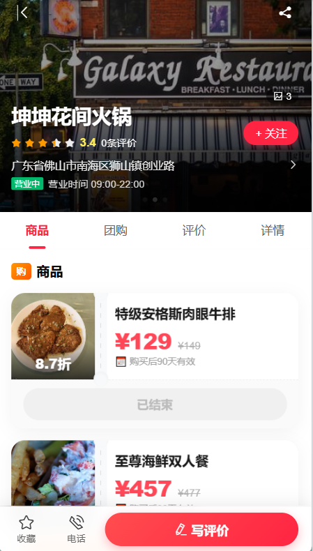
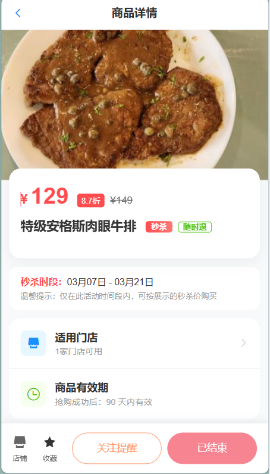
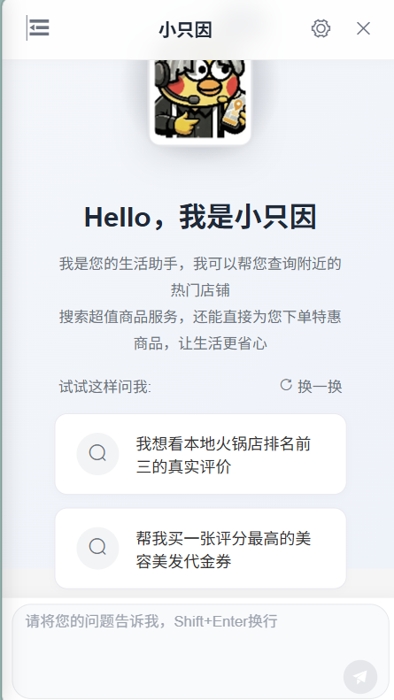
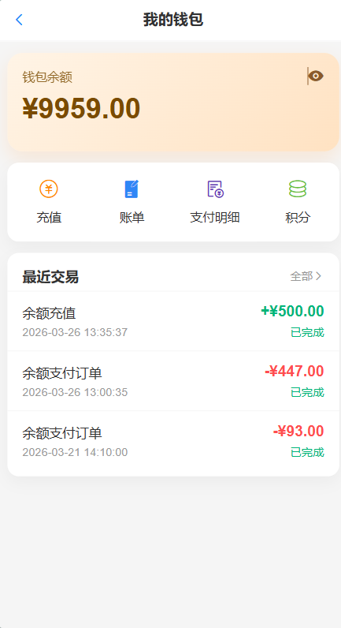

<div align="center">

# 🏙️ SmartLive App — 用户端 App / H5 前台

**SmartLive 智评生活 · Vue 3 用户端应用（移动端 / H5 页面）**

[](https://vuejs.org/)
[](https://vitejs.dev/)
[](https://vant-ui.github.io/vant/)
[](https://element-plus.org/)
[](./LICENSE)

📚 总览文档： [SmartLive 在线文档](https://mumulinya.github.io/smartLive-Cloud/)

</div>

## 📦 项目仓库

| 仓库 | 说明 | 链接 |
|:---:|:---:|:---:|
| **smartLive-Cloud** | 后端主仓库与在线总文档 | [GitHub](https://github.com/mumulinya/smartLive-Cloud) |
| **smartLive-admin** | 商家端与平台管理后台（Vue + Element UI） | [GitHub](https://github.com/mumulinya/smartLive-admin.git) |
| **smartLive-web** | 用户端 App（本仓库） | [GitHub](https://github.com/mumulinya/smartLive-web.git) |

## 🎨 效果预览

| 首页信息流 | 店铺详情 | 商品详情 |
|:---:|:---:|:---:|
|  |  |  |
| **AI 快捷提问** | **即时聊天** | **我的钱包** |
|  |  |  |

## 🖼️ 页面截图索引

| 分组 | 内容说明 | 入口 |
|:---|:---|:---|
| 用户端视觉导览 | 登录、首页、搜索、店铺、商品、订单、评价、社交、AI、钱包与积分的完整大图走查 | [SHOWCASE](https://mumulinya.github.io/smartLive-Cloud/SHOWCASE) |
| 用户端页面映射 | 所有用户端页面名称、分组与截图索引总表 | [PAGE_GALLERY](https://mumulinya.github.io/smartLive-Cloud/PAGE_GALLERY) |
| 当前仓库截图目录 | README 已同步的代表页面截图资源 | [docs/screenshots](./docs/screenshots) |

- 用户端主分组可对照：登录与进入、发现入口与热榜、搜索与 LBS 找店、店铺决策与商品详情、支付订单钱包积分、内容创作与评价互动、社交关系与消息、AI 智能助手与 AIGC、个人中心与收藏安全。

## 📋 文档导航
- [页面截图索引](#页面截图索引)
- [项目定位](#项目定位)
- [功能全景](#功能全景)
- [页面路由清单](#页面路由清单)
- [技术架构](#技术架构)
- [快速开始](#快速开始)
- [环境变量](#环境变量)
- [项目结构](#项目结构)
- [相关文档](#相关文档)
- [常见问题](#常见问题)
- [参与贡献](#参与贡献)

## 项目定位
SmartLive App 是一个基于 `Vue 3 + Vite` 的本地生活类用户端项目，覆盖“找店 -> 搜索 -> 领券/团购 -> 下单支付 -> 评价 -> 社交互动 -> IM -> AI 助手”的完整业务链路。

项目面向移动端场景，包含：
- 通用请求层（Axios 拦截器 + 登录态处理）
- 实时通信（WebSocket 会话与全局未读）
- 流式 AI 对话（SSE）
- 钱包、积分、订单、支付、社交等完整业务模块

适合用于：
- 本地生活类业务前端项目
- Vue 3 中大型工程实践
- 前后端联调演示项目

## 功能全景

### 1. 首页与发现
- 城市定位入口、搜索入口、底部主导航
- 信息流分区：`关注`、`热门`、动态分类
- 优惠入口：`优惠专区`、`秒杀专区`
- 热门榜切换：店铺榜 / 代金券榜 / 团购榜
- 笔记流点赞、懒加载、滚动状态保留
- 首页全局 AI 悬浮入口与快捷提问入口

### 2. 地图找店
- 高德地图动态加载（支持 `VITE_AMAP_KEY`）
- 当前定位获取与重新定位
- 店铺分类、距离筛选
- 地图 Marker 与底部店铺列表联动
- 选中店铺高亮、跳转店铺详情

### 3. 搜索体系
- 全局搜索 Tab：店铺 / 代金券 / 团购 / 笔记 / 用户
- 多维筛选：分类、距离、评分、排序、状态、商品类型
- 热门搜索词、搜索历史（登录态服务端/游客本地）
- 无限滚动加载与请求防抖
- 独立用户搜索页：支持赞过/收藏/作品/关注范围

### 4. 店铺与商品
- 店铺列表：分类/距离/评分/排序筛选
- 店铺榜单 Top 列表
- 店铺详情：图集、营业信息、拨号、地图、关注、收藏
- 商品模块：代金券与团购双分类
- 商品详情：秒杀倒计时、库存校验、进度展示、规则说明
- 商品评论与回复、点赞、关注、收藏

### 5. 订单与支付
- 订单列表状态筛选：全部/待支付/未使用/已使用/已取消/已退款
- 订单详情、使用二维码、取消订单、申请退款
- 收银台支持：余额支付、微信扫码/微信 H5、支付宝扫码/支付宝 H5
- 支付状态轮询与结果页回跳
- 支付明细列表、待支付记录倒计时与取消

### 6. 评价系统
- 待评价订单列表（从订单侧发起）
- 发布/编辑评价：总体评分 + 口味/环境/服务分
- AI 帮写评价、评价修改与草稿箱管理
- 图文/视频上传、匿名评价
- 草稿保存与草稿箱管理
- 我的评价列表（全部/店铺/商品）
- 评价详情：点赞、收藏、评论、回复、删除

### 7. 笔记社区
- 发笔记/编辑笔记（支持图片上传与店铺关联）
- AI 帮写博客与笔记草稿联动
- 笔记草稿保存与发布
- 笔记详情：点赞、收藏、关注作者、评论与多级回复
- 笔记分享（系统分享/复制链接）
- 作者能力：置顶、编辑、删除

### 8. 社交关系与个人内容
- 加好友（搜索用户 + 关注/取消关注）
- 关注/粉丝/共同关注列表
- 我的关注：用户 / 店铺 / 商品
- 我的互动：我赞过的、我的评论（按来源过滤）
- 我的收藏：店铺 / 笔记 / 商品
- 我的动态（Feed 流）
- 他人主页访问与私信发起

### 9. 即时通讯与系统通知
- 会话列表：未读数、系统会话、搜索入口
- 私聊页：文本/图片消息、表情、消息状态
- 聊天设置：会话置顶、背景图设置、聊天记录日期导航
- 历史消息按日期跳转（聊天日历）
- 系统通知页：未读统计、单条/全部已读、图片预览、业务跳转
- WebSocket 全局连接：鉴权、心跳、断线重连、全局分发

### 10. AI 智能助手
- 首页悬浮入口 + 快捷提问页
- AI 对话页 SSE 流式输出（打字机效果）
- AI 会话列表与历史管理
- Markdown 渲染
- AI 推荐商家卡片、商品卡片与快捷追问
- 推荐商品支持一键下单（普通/秒杀）与订单结果卡片回显
- AI 帮写评价、AI 帮写博客与结果内容回填

### 11. 用户与安全
- 登录方式：短信验证码登录、密码登录
- 密码登录滑块验证（`vue3-puzzle-vcode`）
- 用户资料：头像、昵称、性别、生日、简介、背景图
- 个人主页/他人主页（统计数据、内容分栏）
- 账号安全：设置密码、修改密码
- 登录态变更广播（用于 WS 与页面缓存同步）

### 12. 钱包与积分
- 钱包余额展示与快捷入口
- 充值（复用统一支付流程）
- 钱包账单（收支、状态）
- 支付明细（支付渠道、状态、取消）
- 积分主页：签到、积分余额
- 积分明细列表
- 积分抽奖

## 页面路由清单

### 核心入口
| 路由 | 功能 |
| --- | --- |
| `/` | 首页信息流与榜单 |
| `/search` | 全局搜索页 |
| `/search/user` | 用户搜索页 |
| `/map` | 地图找店 |
| `/ai` | AI 对话主页面（含快捷提问、会话列表、推荐卡片、AI 下单结果） |

### 用户与账户
| 路由 | 功能 |
| --- | --- |
| `/user/login` | 登录页（验证码/密码） |
| `/user/profile` | 我的主页（别名：`/info`、`/user/info`） |
| `/user/profile/:id` | 他人主页（别名：`/user-info/:id`） |
| `/user/edit` | 编辑资料 |
| `/user/password/update` | 修改密码 |
| `/user/password/set` | 设置密码 |
| `/user/add-friend` | 添加好友 |
| `/user/list` | 关注/粉丝/共同关注列表 |
| `/user/follow` | 我的关注 |
| `/user/interactions` | 我的互动 |
| `/user/star` | 我的收藏 |
| `/user/moments` | 我的动态 |

### 交易与资金
| 路由 | 功能 |
| --- | --- |
| `/order/list` | 订单列表 |
| `/order/detail` | 订单详情 |
| `/pay/checkout` | 收银台 |
| `/pay/result` | 支付结果页 |
| `/user/wallet` | 钱包主页 |
| `/user/wallet/recharge` | 钱包充值 |
| `/user/wallet/bill` | 钱包账单 |
| `/user/wallet/payment-record` | 支付明细 |
| `/user/points` | 积分主页 |
| `/user/points/detail` | 积分明细 |
| `/user/points/lottery` | 积分抽奖 |

### 店铺、商品与内容
| 路由 | 功能 |
| --- | --- |
| `/shop/list` | 店铺列表 |
| `/shop/top` | 店铺榜单 |
| `/shop/detail` | 店铺详情 |
| `/product/top` | 商品榜单 |
| `/product/detail` | 商品详情 |
| `/deal/list` | 优惠聚合页（代金券/团购） |
| `/blog/detail` | 笔记详情 |
| `/blog/edit` | 发笔记/编辑笔记（含 AI 博客生成） |
| `/drafts` | 草稿箱聚合页（评价+笔记） |
| `/review/mine` | 我的评价 |
| `/review/drafts` | 评价草稿页 |
| `/review/detail` | 评价详情 |
| `/review/publish` | 发布/编辑评价（含 AI 评价生成） |

### 聊天与通知
| 路由 | 功能 |
| --- | --- |
| `/chat/list` | 聊天会话列表 |
| `/chat/detail` | 私聊详情 |
| `/chat/info` | 聊天设置 |
| `/chat/system` | 系统通知 |
| `/chat/history-calendar` | 聊天历史日历 |

### 重定向路由
| 路由 | 功能 |
| --- | --- |
| `/user/my-reviews` | 重定向到 `/review/mine` |
| `/review/wait` | 重定向到 `/review/mine?tab=pending` |

## 技术架构

| 类别 | 技术 | 说明 |
|:---|:---|:---|
| 核心框架 | Vue 3.3 | Composition API + 响应式系统 |
| 构建工具 | Vite 4 | 极速 HMR，自动导入插件 |
| 路由 | Vue Router 4 | 懒加载 + keepAlive 页面缓存 |
| 移动端 UI | Vant 4 | 自动按需导入（unplugin-vue-components） |
| 桌面端 UI | Element Plus 2 | 日期选择 / 评分 / 级联等复杂组件 |
| 网络请求 | Axios | 统一拦截器、Token 自动注入、401 自动跳转 |
| 实时通信 | WebSocket | 双类架构（ChatWebSocket + GlobalWebSocketManager），心跳保活 + 断线重连 |
| 流式输出 | SSE | AI 对话打字机效果，EventSource 封装 |
| 地图服务 | 高德地图 JS API | 动态加载、定位、Marker 联动 |
| 富文本 | markdown-it | AI 回复 Markdown 渲染 |
| 二维码 | qrcode.vue | 订单核销二维码 |
| 登录验证 | vue3-puzzle-vcode | 滑块拼图验证 |
| 性能优化 | 自实现 | 防抖 / 节流 / 懒加载 / 滚动状态保留 |

### 🛠️ 工程化亮点

- 🔌 **WebSocket 双层架构** — `ChatWebSocket` 封装连接/鉴权/心跳/重连，`GlobalWebSocketManager` 管理多页面回调分发
- 📡 **SSE 流式封装** — EventSource 统一封装，支持打字机效果、错误重试、手动中断
- 📣 **系统通知引擎** — `systemNotice.js`（9.4KB）独立封装未读计数/消息路由/图片预览/业务跳转
- 🌐 **定位服务** — `location.js`（3.9KB）封装浏览器定位 + 高德地图逆地理编码
- ⚡ **性能工具** — 自实现 `debounce` / `throttle`，速度优先无第三方依赖
- 🔒 **登录态广播** — `auth-event.js` 全局事件总线，登录/登出触发 WS 重连与页面缓存清理
- 🎴 **全局 AI 悬浮入口** — `GlobalAIEntry.vue`（12KB）支持快捷提问 + 拖拽定位
- 📰 **Feed 流组件** — `FeedItem.vue`（25KB）封装点赞/收藏/评论/分享交互、懒加载、滚动保留

## 快速开始

### 环境要求
- Node.js `>=16`
- npm `>=7`

### 1. 安装依赖
```bash
npm install
```

### 2. 启动开发环境
```bash
npm run dev
```
默认访问：`http://localhost:5173`

### 3. 构建生产包
```bash
npm run build
```

### 4. 本地预览生产包
```bash
npm run preview
```

## 环境变量

### 新建本地配置
macOS / Linux:
```bash
cp .env.example .env.local
```

Windows PowerShell:
```powershell
Copy-Item .env.example .env.local
```

### 变量说明
| 变量名 | 说明 | 默认值/示例 |
| --- | --- | --- |
| `VITE_API_BASE_URL` | 前端 API 前缀 | `/app-dev-api` |
| `VITE_MINIO_URL` | 文件服务地址 | `http://127.0.0.1` |
| `VITE_MINIO_PORT` | 文件服务端口 | `9000` |
| `VITE_FILE_PREFIX` | 文件服务路径前缀 | `/smart-live` |
| `VITE_FILE_URL` | 完整文件访问地址（可选，优先级最高） | `http://127.0.0.1:9000/smart-live` |
| `VITE_WS_HOST` | WS 主机（默认拼成 `ws://host:8888/ws`） | `localhost` |
| `VITE_WS_URL` | 完整 WS 地址（可选，优先级最高） | `ws://localhost:8888/ws` |
| `VITE_AMAP_KEY` | 高德地图 Key（地图页需要） | `your_amap_key` |


## 项目结构
```text
smart-live-app/
├─ src/
│  ├─ api/                # 接口层（16 个模块）
│  │  ├─ ai.js             #   AI 对话 / 会话 / 推荐
│  │  ├─ chat.js           #   私聊消息
│  │  ├─ interaction.js    #   点赞 / 收藏 / 评论 / 关注 / Feed
│  │  ├─ order.js          #   订单 CRUD
│  │  ├─ pay.js            #   统一支付
│  │  ├─ points.js         #   积分 / 签到 / 抽奖
│  │  ├─ product.js        #   商品查询
│  │  ├─ reviews.js        #   评价 CRUD
│  │  ├─ search.js         #   搜索 / 历史 / 热词
│  │  ├─ shop.js           #   店铺查询
│  │  ├─ systemNotice.js   #   系统通知
│  │  ├─ user.js           #   用户 / 资料 / 关注
│  │  ├─ wallet.js         #   钱包 / 充值 / 账单
│  │  └─ ...               #   blog / common / userSearch
│  ├─ assets/             # 静态资源与样式
│  ├─ components/         # 通用组件
│  │  ├─ GlobalAIEntry.vue #   AI 全局悬浮入口（12KB）
│  │  ├─ FeedItem.vue      #   Feed 流卡片组件（25KB）
│  │  ├─ FootBar.vue       #   底部导航栏
│  │  └─ PageLayout/       #   页面布局框架
│  ├─ config/             # 业务配置（Feed 状态映射等）
│  ├─ router/             # 路由配置（60+ 路由）
│  ├─ store/              # 轻量状态（用户 / 聊天未读）
│  ├─ utils/              # 工具函数
│  │  ├─ request.js        #   Axios 封装 + Token 拦截
│  │  ├─ websocket.js      #   WebSocket 双层架构（315 行）
│  │  ├─ sse.js            #   SSE 流式封装
│  │  ├─ systemNotice.js   #   系统通知引擎
│  │  ├─ location.js       #   定位服务封装
│  │  ├─ debounce.js       #   防抖工具
│  │  ├─ throttle.js       #   节流工具
│  │  └─ auth-event.js     #   登录态事件总线
│  └─ views/              # 页面模块（16 个）
│     ├─ home/             #   首页信息流 + 榜单
│     ├─ search/           #   全局搜索 + 用户搜索
│     ├─ map/              #   地图找店
│     ├─ shop/             #   店铺列表 / 榜单 / 详情
│     ├─ product/          #   商品详情 / 榜单
│     ├─ deal/             #   优惠聚合（代金券/团购）
│     ├─ order/            #   订单列表 / 详情
│     ├─ pay/              #   收银台 / 支付结果
│     ├─ review/           #   评价发布 / 编辑 / 详情 / AI 评价生成
│     ├─ blog/             #   笔记发布 / 编辑 / 详情 / AI 博客生成
│     ├─ draft/            #   草稿箱聚合
│     ├─ chat/             #   会话列表 / 私聊 / 系统通知 / 历史日历
│     ├─ ai/               #   AI 对话 / 快捷提问 / 推荐结果
│     └─ user/             #   登录 / 资料 / 钱包 / 积分 / 社交
├─ docs/                  # 业务对接文档
├─ public/                # 公共静态资源
├─ .env.example           # 环境变量模板
├─ vite.config.js         # Vite 与代理配置
└─ package.json
```

## 相关文档

- [SmartLive 在线文档](https://mumulinya.github.io/smartLive-Cloud/)
- [后端主仓库 smartLive-Cloud](https://github.com/mumulinya/smartLive-Cloud)
- [开源接入说明](https://mumulinya.github.io/smartLive-Cloud/OPEN_SOURCE)

## 常见问题
### 1. 本地接口请求不到后端？
- 检查 `vite.config.js` 的代理目标（默认 `http://127.0.0.1:8080`）是否与你后端一致。
- 检查 `.env.local` 中 `VITE_API_BASE_URL` 是否与代理前缀一致。

### 2. 聊天收不到实时消息？
- 确认 `token` 已写入本地存储并完成 WebSocket 鉴权。
- 检查 `VITE_WS_HOST` / `VITE_WS_URL` 是否正确。

### 3. 地图页面不显示？
- 配置 `VITE_AMAP_KEY`。
- 检查浏览器定位权限是否开启。

### 4. AI 页面为什么没有返回推荐内容？
- 确认后端 AI 与向量检索相关服务已启动。
- 优先检查 SSE 接口、登录态以及店铺/商品基础数据是否已准备完毕。

## 🤝 参与贡献

欢迎通过 Issue 或 PR 一起完善这个仓库。

在提交改动前，建议先阅读 [CONTRIBUTING.md](./CONTRIBUTING.md)，至少确认这几项：
- 分支命名和提交信息清晰可读
- 截图、README 与实际页面保持一致
- 涉及接口变更时同步更新联调说明

## 📄 开源协议

本项目基于 [MIT License](./LICENSE) 开源。

---

<div align="center">

**如果觉得不错，请给我们一个 ⭐ Star 吧!**

Made with ❤️ by SmartLive Team

</div>
